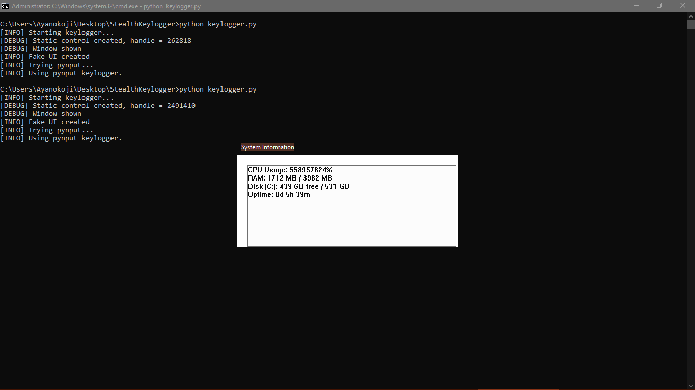
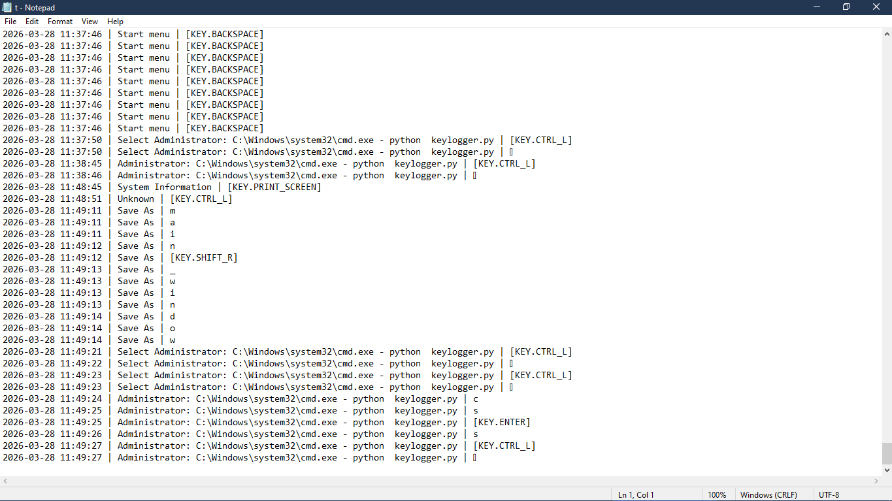

# 🎓 Keylogger Educational Analysis

> [!CAUTION]
> **LEGAL NOTICE:** This project is strictly for **authorized security testing, forensic research, and educational purposes**. Unauthorized use of these techniques against systems you do not own is illegal and violates GitHub's Acceptable Use Policies.

---

## 1. Introduction

This repository provides a **Keylogger Educational Analysis** to demonstrate how modern input-monitoring tools can masquerade as legitimate system utilities. By analyzing this codebase, security students and researchers can study the intersection of **Social Engineering (UI Masquerading)** and **Low-Level Windows API Hooking**.

The program simulates a "Living off the Land" (LotL) threat by displaying real-time system data (CPU, RAM, disk space) while demonstrating how background processes can remain resilient to user termination. This is a vital resource for understanding the mechanics of credential-harvesting threats and developing effective defensive signatures.

---

## Screenshots


*Figure 1: Demonstration of a functional UI used to divert user attention.*


*Figure 2: Forensic analysis of recovered and decrypted input data.*

---

## 2. Technical Analysis of Features

This project explores several key areas of Windows security and software behavior:

* **UI Masquerading Techniques:** Demonstrates a functional acrylic glass interface (Windows 10/11 style) to show how background tasks can be hidden behind "genuine-looking" system tools.
* **API Hooking Analysis:** Studies the implementation of `SetWindowsHookEx` (Low-Level Keyboard Hook) and explores fallback mechanisms like `pynput` and polling to understand how tools maintain functionality when hooks are blocked.
* **Cryptographic Data Protection:** Analyzes the use of **AES-256-GCM** encryption. The research demonstrates how hardware-bound keys (Machine ID) prevent logs from being read on unauthorized devices.
* **Persistence Mechanism Research:** Explores the implementation of Registry Run keys and Windows Scheduled Tasks to study how software ensures survival across system reboots.
* **Process Resilience:** Analyzes "minimize-to-background" logic as a method of maintaining process uptime.

---

## 3. Requirements & Environment

To conduct this analysis safely:
* **OS:** Windows 10/11 (Recommended for UI effects).
* **Language:** Python 3.6+.
* **Environment:** Conduct all tests within an **isolated Virtual Machine (VM)**.

---

## 4. Setting up the Research Environment

### Option A – Source Code Analysis (Requires Python)

1.  Clone the repository and navigate to the directory.
2.  Install the required research libraries:
    ```bash
    pip install -r requirements.txt
    ```
    *(Dependencies: pywin32, pycryptodome, and pynput for API interaction.)*
3.  Execute the script to observe API behavior:
    ```bash
    python keylogger.py
    ```

### Option B – Standalone Binary Analysis

Researchers can study the behavior of the tool as a compiled entity using `PyInstaller`:
```bash
pyinstaller --onefile --noconsole --name "SystemInfo_Analysis" keylogger.py
```

---

## 5. Usage for Security Auditing
- ​Upon execution, the "System Information" window provides a diversionary UI.
- ​The research tool begins monitoring input, which is recorded for forensic study.
- ​Closing the window demonstrates "Resilience Logic" by minimizing to the background rather than terminating.
- ​To end the analysis, use Task Manager to terminate the process or utilize the provided uninstall switch.

---

## 6. Forensic Log Analysis
- ​This project teaches how to locate and analyze artifacts left by monitoring tools.
- Default Artifact Path:
```
%APPDATA%\Microsoft\Windows\logs\keystrokes.enc
```

- To study the recovered data, use the provided decrypt.py utility:
```
python decrypt.py "%APPDATA%\Microsoft\Windows\logs\keystrokes.enc"
```

---

## 7. Understanding Persistence Mechanisms
- ​To study how threats maintain a presence on a system, the CONFIG dictionary can be toggled to persistence: True.
- This demonstrates:
​Registry Manipulation: Writing to HKCU\Software\Microsoft\Windows\CurrentVersion\Run.
- Task Scheduling: Automating execution via Windows Task Scheduler.
- ​Note: This requires elevated privileges to simulate an Administrative-level compromise.

---

## ​8. Removal & Cleanup
​To remove research artifacts and persistence entries, run the script with the uninstall switch:
```
python keylogger.py --uninstall
```

---

## 9. Defensive Countermeasures (The Defender's Perspective)
- ​A core goal of this analysis is to improve detection. Defenders should focus on:
- ​Behavioral Detection: Monitoring for unsigned processes calling SetWindowsHookEx.
- Audit Persistence: Regularly checking Registry Run keys and the Task Scheduler for unexpected entries.
- EDR/AV: Utilizing Endpoint Detection and Response tools that flag the use of pynput or raw Win32 hooks in non-system processes.

---

## ​10. Threat Vectors for Future Study
- ​These concepts represent advanced techniques used by real-world threat actors. Studying these helps in developing high-level defensive strategies:
- ​Network Exfiltration (C2): Analyzing how data could be sent via HTTPS to a remote Command & Control server.
- ​Clipboard & Screenshot Auditing: Understanding how sensitive data (passwords/PII) is captured beyond keystrokes.
- ​Process Injection: Researching how monitoring code can be injected into legitimate system processes (e.g., explorer.exe).
- ​Rootkit-level Hooks: Exploring the difference between user-land hooks and kernel-level drivers.

---

## ​⚠️ Educational Compliance & T&C
​This repository is a learning resource. It does not provide pre-compiled malware and is intended to help the security community build better detection signatures.

- ​Prohibited Use: Deployment on any system without explicit owner consent.
- ​Liability: The author assumes no responsibility for misuse. This is "as-is" research material for ethical hackers and security professionals.
- ​GitHub Policy: This project complies with GitHub’s policy on security research by focusing on defensive analysis and educational documentation.
